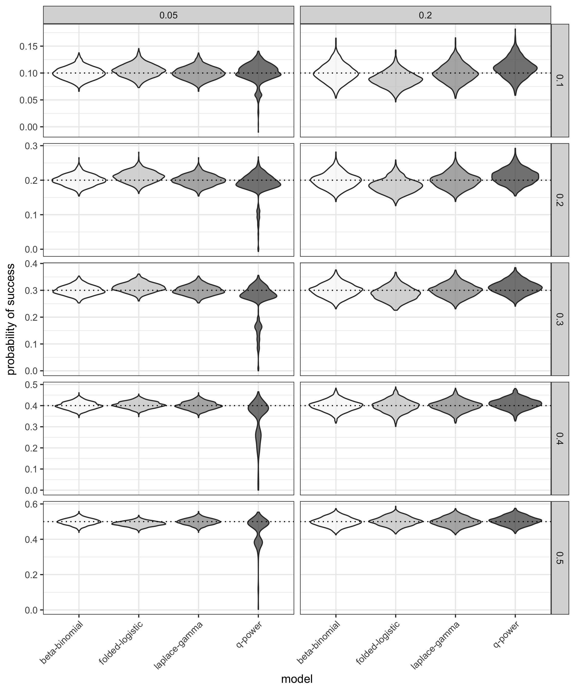
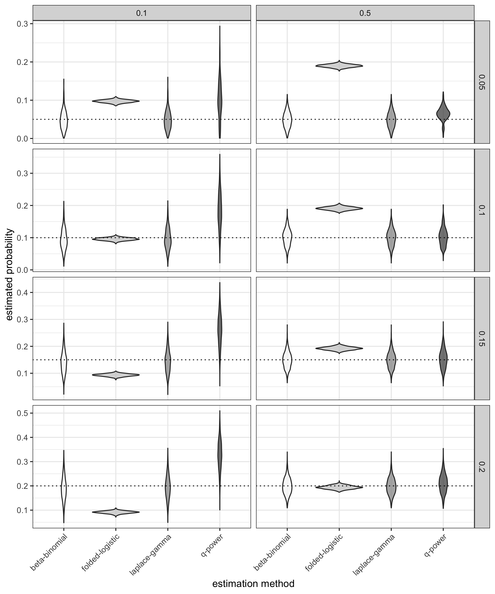
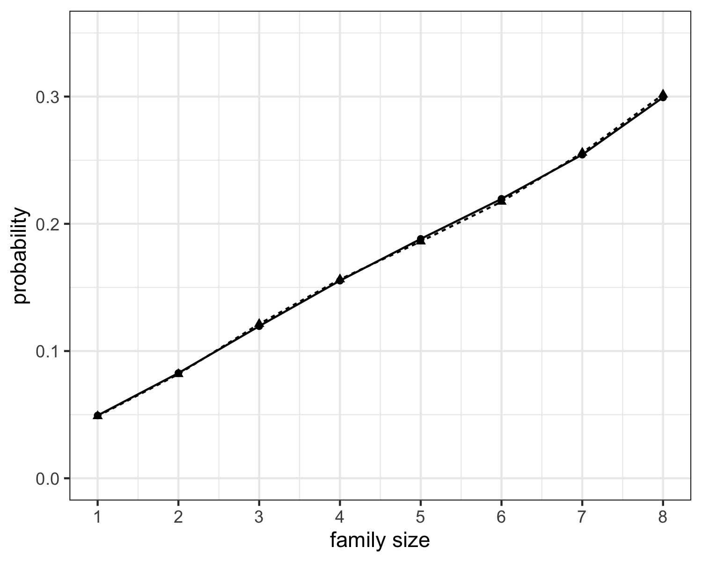
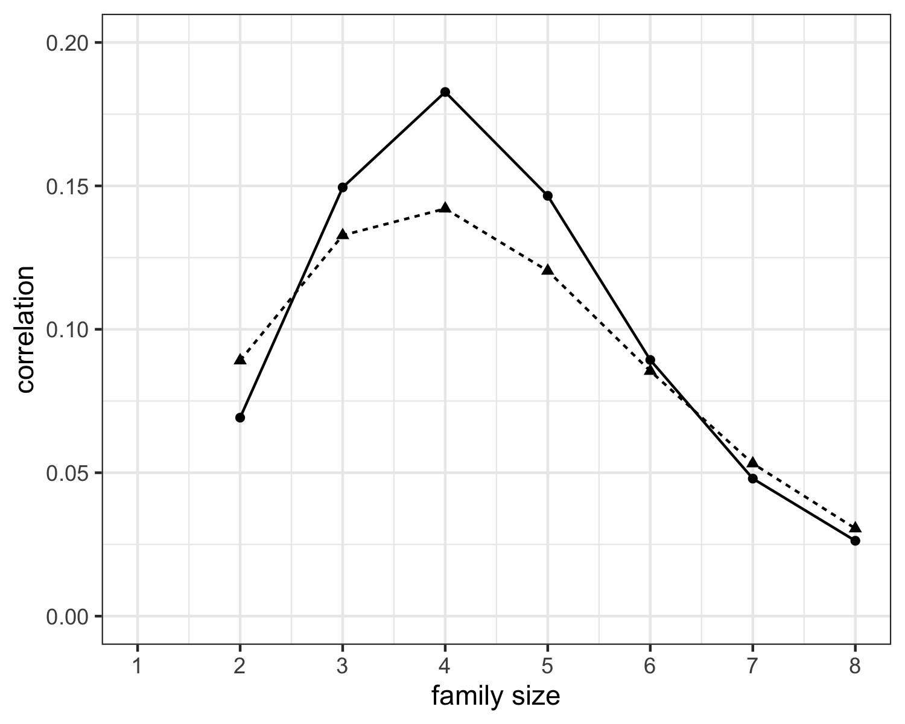

```{r packages, include = F}
library(dplyr)
library(knitr)
library(kableExtra)
```

```{r data, include = F}
parm_ests <- tibble(fl = c(0.567, 0.214),
                    bb = c(0.581, 0.087),
                    lg = bb,
                    qp = bb)

obs_exp <- tibble(m = 0:3,
                  obs = c(32, 103, 122, 80),
                  bin = c(24.86, 103.24, 142.93, 65.96),
                  fl = c(50.59, 90.57, 104.45, 91.39),
                  bb = c(33.97, 97.16, 127.67, 78.20),
                  lg = c(33.97, 97.20, 127.61, 78.23),
                  qp = c(32.43, 102.02, 122.69, 79.86))
```

# Introduction

Correlated binary outcomes, either by design or through natural conditions, is 
a common occurrence in many fields. Examples include measuring a Bernoulli
outcome in a repeated measures study, teratological risk assessment, studies of
familial diseases and genetic traits, and group randomization studies, among
many others. Of immediate concern around the world, COVID-19 positivity tests 
within a family or geographical unit introduce potentially correlated binary 
outcomes.

@kuk:2004 provides a nice introduction to developmental toxicity 
studies and the statistical issues therein. We will summarize the details from 
their paper as its development is closely related to what is presented here. In 
a standard developmental toxicology study, pregnant laboratory animals are 
often randomly assigned to receive varying dose levels of a toxic substance 
during a major period of organogenesis. Their lives are usually terminated
before giving birth, their uterus is subsequently removed and examined for
possible birth defects. For each litter in such a study, there is a sequence of 
Bernoulli random variables $X_1, X_2,\ldots,X_m$ where $X_i=0,1$, denoting the 
absence or presence of the birth defect. 

It is commonly assumed that members of the same litter will behave more 
similarly than nonlittermates and, therefore, one may assume a degree of
correlation between littermates.  @kuk:2004 notes that litter effect can be 
accounted for by assuming the intralitter correlation is induced by a random
effect that is shared by all fetuses in the same litter. This random effect
accounts for all of the environmental and genetic factors that littermates 
share in common. @pang:2005 point out that, "failure to account for litter 
effect and the overdispersion it induces will lead to estimates with overstated 
precision."

In earlier work, @will:1975 states that it is necessary to model variation
between fetuses in the same litter and variation between litters receiving the 
same treatment.  It is this insight that leads to the development of the 
beta binomial model for application to toxicological experiments involving 
reproduction and teratogenicity. @will:1975 essentially assumes that the 
probability of response varies as a beta distribution between dose groups to 
model the overdispersion due to litter effect. It should be noted that 
@Skel:1948 was first to propose the idea of using the beta distribution to 
describe variation in the probability parameter of the binomial distribution. 
For a large portion of the past 40+ years, the beta binomial distribution has 
been the gold standard when it comes to modeling clustered binary data. 
Additional models include a correlated binomial model proposed by @kup_hase, 
a correlated beta binomial model discussed by @paul and @pack, an extended 
beta binomial model introduced by @pren:1986, and "additive" and 
"multiplicative" generalizations of the binomial given in @Alth:1978.

@Geor:Bowm:1995 developed an exact distribution for sums of exchangeable 
binary variables. In addition, they propose an approximating model for 
$\lambda_k=P(X_1=X_2=\cdots =X_k=1)$, $k=1,2,\ldots,m$ using 
$\lambda_k=f(k;\beta)$ where $f$ is the completely monotone folded-logistic 
function.  A drawback to this model is that with only a single parameter $\beta$,
this model lacks the flexibility of many two-parameter models,  such as the 
beta binomial model, when estimating success probability and intra-cluster
correlation. 

@kuk:2004 notes that the shape of the beta binomial 
probability function is often U-shaped, J-shaped, or reverse J-shaped instead of 
unimodal with the mode near the expected value of $mp$. Hence, all of the 
probability mass could be concentrated at 0 and $m$, and a value near the 
``expected'' value could be very unlikely. Essentially what happens is that the beta binomial, and other existing distributions, tend to underestimate the risk 
of at least one littermate having a birth defect. @kuk:2004 introduced the 
$q$-power model that is based on the exchangeable theory developed in 
@Geor:Bowm:1995. The shared response model, introduced in @pang:2005, can model 
the data without overestimating the probability of no affected fetuses.

In this manuscript, we propose a new (approximate) distribution for handling 
exchangeable binary data. Our model is based on the theory of @Geor:Bowm:1995,
and is similar to @kuk:2004, @yu2008sums, and @bowman2016statistical in its
development. Background information related to several previous models, and our 
new model are introduced in Section [2][Model Development]. In Section 
[3](Monte Carlo Simulation), we present the 
results of a large-scale Monte Carlo study designed to assess several 
statistical properties of the proposed model relative to those of existing 
methods.  Two classic examples are analyzed in Section [4](Examples) and our concluding remarks are reported in Section [5](Discussion).

# Model Development

## Prior Research 

Modeling finite sums of exchangeable binary random variables is 
explored in detail in the papers of @Geor:Bowm:1995, @Bowm:Geor:1995, and 
@Geor:Kode:1996, among other papers outlined in Section 1. An exact distribution
for the sum of exchangeable binary random variables is derived in 
@Geor:Bowm:1995. We summarize their results in order to develop our proposed
model.

Let $\bm{Y}=(Y_1,Y_2,\dots,Y_m)^T$ denote a vector of exchangeable binary random 
variables. By exchangeable, we mean that
\begin{equation*}
  (Y_1, Y_2, \dots, Y_k)^T \stackrel{D}{=} (Y_{\pi(1)}, Y_{\pi(2)},\dots, Y_{\pi(k)})^T
\end{equation*}
for any permutation $\pi$ of the integers $\{1,2,\dots,k\}$.  We are interested 
in making inferences on the quantity $S_m = \sum_{j=1}^m Y_j$ for $k \le m$.
From a straightforward application of the Inclusion-Exclusion principle in 
probability, the exact distribution of these sums can be shown to be
\begin{equation}
  \label{eq:sum_dist}
  P[S_m=s] = {m \choose s}\sum_{k=0}^{m-s}(-1)^k{m-s \choose k}p_{s+k},\ \ \mbox{for} \ \ s = 0,1,\dots,m,
\end{equation}
where,
\begin{align}
  \label{eq:sum_constraint}
  p_j & = P[Y_1=1,Y_2=1,\dots,Y_j=1], \ \ j=1,2,\dots,m, \ \mbox{and} \nonumber \\
  1 & = p_0 \ge p_1 \ge p_2 \ge \dots \ge p_m.
\end{align}

Parameter estimates of $p_1, \dots, p_m$, and hence any $k^{th}$-order 
correlation can be found in the following way. An observation $S_m=s$ is simply
an indicator random variable following a multinomial distribution having cell 
probabilities given by $P[S_m=j]$ for $j=0,1,\dots,m$.  Using the inversion 
formula
\begin{equation*}
  p_j = \sum_{k=0}^{m-j}\frac{{m-j \choose k}}{{m \choose k}}P[S_m = m-k],
\end{equation*}
we can find the desired estimates. Variance estimates are computed based on the
distributional properties of multinomial probabilities. Rather than estimating
each individual $p_j$ using a saturated approach, it is
possible to model these parameters using a function which preserves the
constraints given above, namely that
\begin{align}
  \label{eq:constraints}
  1  & =  p_0 \ge p_1 \ge p_2 \ge \dots \ge p_m,\ \ \mbox{and} \nonumber \\
 &  \sum_{k=0}^{m-s}(-1)^k{m-s \choose k}p_{s+k} \ge 0.
\end{align}

@Geor:Bowm:1995 suggest using the folded-logistic function to model the sequences
of probabilities in order to approximate the model defined in Equation 
\eqref{eq:sum_dist}. The folded-logistic function is defined by
\begin{equation*}
  p_x(\beta) = \frac2{1+(x+1)^\beta}
\end{equation*}
for $x\ge0$ and $\beta >0$. Under this parameterization, Equation 
\eqref{eq:sum_dist} becomes
\begin{equation}
	\label{eq:gb_parm}
  P[S_m=s;\beta] = {m \choose s}\sum_{k=0}^{m-s}(-1)^k{m-s \choose k}\frac2{1+(s+k+1)^\beta},
\end{equation}
for $s = 0,1,\dots,m$. The estimation problem is now reduced to estimating a
single parameter, $\beta$, rather than estimating the $m$ individual $p$'s.

@kuk:2004 introduces two additional distributions based on the theory of 
completely monotone functions. Note that a function $\varphi$ is completely 
monotone if it possesses derivatives $\varphi^{(n)}$ of all orders and 
$(-1)^n\varphi^{(n)}(\lambda) \ge 0$, for $\lambda >0$. In the first, Kuk models 
the sequence of probabilities $1=p_0 \geq \ldots \geq p_m$  by
$$
\lambda_k=P(X_1=X_2=\ldots=X_k=1)=p^{k^{\gamma}}
$$
where $k=0,1,\ldots,m$ and $0\leq p,\gamma \leq 1$. The parameter $p$ is the
marginal response probability and the parameter $\gamma$ controls the degree 
of association between littermates. A value of $\gamma=1$ corresponds 
to independence between littermates while a value of $\gamma=0$ corresponds to
complete dependence between littermates. Under this parameterization,
\eqref{eq:sum_dist} can be written as
\begin{equation}
	\label{eq:pp_dens}
	P(S_m=s;p,\gamma)={m \choose s}\sum_{k=0}^{m-s}(-1)^k {m-s \choose k}p^{(s+k)^{\gamma}}.
\end{equation}
Kuk refers to this model as the $p$-power distribution.

Kuk mentions that one may also use the same type of power-family model for 
$X'=1-X$.  In this case, $q=1-p=P(X'=1)=P(X=0)$ and, therefore,
$$
\lambda'_k=P(X'_1=X'_2=\cdots=X'_k=1)=P(X_1=X_2=\cdots=X_k=0)=q^{k^{\gamma}}.
$$
This results in the $q$-power probability distribution given by
\begin{equation}
	\label{eq:qp_dens}
	P(S_m=s;q,\gamma)=P(S'_m=m-s|q,\gamma)={m \choose s}\sum_{k=0}^s(-1)^k {s \choose k}q^{(m-s+k)^{\gamma}}
\end{equation}
where $0\leq q,\gamma \leq 1$. Kuk advocates for the use of the $q$-power 
distribution over the $p$-power distribution when modeling overdispersed binary 
data.

## Laplace Transform of the Gamma (LapGam) Distribution

Our development relies on the theory presented in Section 2.1, along
with the following theory on the difference operator $\Delta$, as given in 
@fellerv2. The difference operator $\Delta$ is defined on a sequence $\{c_n\}$ 
to be $\Delta c_n = c_{n+1} - c_n$. If we apply the difference operator to the
new sequence $\Delta c_n$, we get another sequence 
$\Delta^2c_n = \Delta(\Delta c_n)$. Similarly, the higher-order differences are
defined recursively by $\Delta^r c_n = \Delta (\Delta^{r-1}c_n)$, where 
$\Delta^1 = \Delta$.  It can be shown that the $r^{th}$-order difference can be
written as
\begin{equation}
  \label{eq:r_difference}
  \Delta^r c_n = \sum_{k=0}^r{r \choose k}(-1)^{r+k}c_{n+k}.
\end{equation}
This leads to the following definition. 
```{definition, name = "Feller V2"}
  A sequence $\{c_n\}$ such that $(-1)^r\Delta^rc_\nu \ge 0$ for all combinations $r,\nu$ is called a completely monotone sequence.
```

Applying these results to the sequence $\{p_n\}$ given above, we see that if 
$\{p_n\}$ is completely monotone, then the constraints defined in 
\eqref{eq:constraints} are satisfied. We will model such a sequence using a
*completely monotone function*. Our main result, summarized next, is a direct 
application of the following theorem using the gamma distribution function.

```{theorem, name = "Feller V2"}
  A function $\varphi$ on $(0,\infty)$ is the Laplace transform of a probability distribution F, iff it is completely monotone, and $\varphi(0) = 1$.
```

\begin{result}
The function $p_x$ defined by
\begin{equation}
\label{eqn:p_x}
    p_x(\alpha,\beta) = \frac1{[1+\beta x]^\alpha}
\end{equation}
for $x \ge 0$ and $\beta,\alpha >0$ is a completely monotone function.
\end{result}
To see this, let $F$ be the distribution function of a gamma random variable with mean $\alpha\beta$ and variance $\alpha\beta^2$, for parameters $\alpha,\beta >0$. The Laplace transform of $F$ is given by
  \begin{equation}
    \varphi_\lambda(\alpha,\beta)  = \int_0^\infty e^{-\lambda x}\dif F(x) = \frac1{(1+\beta\lambda)^\alpha}.
  \end{equation}
Therefore, $p_x(\alpha,\beta)$ is a completely monotone function by Feller's result given above.

Similarly to the ideas presented in @Geor:Bowm:1995 and @kuk:2004, we will use
this function as a model for the sequence $1 = p_0 \ge p_1 \ge \dots \ge p_m$.
Therefore, an approximate distribution of $S_m$ under this parameterization is
\begin{equation}
  \label{eq:lap_gam}
    P[S_m=s;\alpha,\beta] = {m \choose s}\sum_{k=0}^{m-s}(-1)^k{m-s \choose k}\frac1{[1+\beta(s+k)]^\alpha}
\end{equation}
for $s=0,1,\dots,m$.  We will refer to this distribution as the Laplace 
transform of the gamma distribution, or the LapGam for short.

We wish to emphasize that the distribution defined in 
Equation (10) is constructed from the gamma distribution function and the 
theory of completely monotone functions. There are no doubt additional 
distributions similar to the LapGam that can be defined using distribution 
functions characterized by multiple parameters. Hopefully the theory presented 
here will spur additional work in the area.

## Estimation

Let $S_{m1},S_{m2},\dots,S_{mn}$ be a random sample of sums of exchangeable 
binary random variables defined by $S_{mi} = \sum_{j=1}^mY_{ij}$ where 
$P[Y_{ij}=1]=p_1$.  We will assume that $S_{mi}$ follows the distribution given 
by (\ref{eq:sum_dist}) with
\begin{equation}
  \label{eq:lap_gam_p}
  p_{s+k} = p_{s+k}(\alpha,\beta) = \frac1{\left[1+\beta(s+k)\right]^{\alpha}}.
\end{equation}
Thus, the log-likelihood function for this sample can be written as
\begin{align}
  \label{eq:exch_ll}
  l_n(\alpha,\beta;\bm{s}) &= \log \left(\prod_{i=1}^nP[S_m=s_i;\alpha,\beta]\right) \nonumber \\
  &= \sum_{i=1}^n \log{m \choose s_i} + \sum_{i=1}^n \log \left(\sum_{k=0}^{m-s_i}(-1)^k{m-s_i \choose k}p_{s_i+k}(\alpha,\beta)\right) \nonumber \\
  &= \sum_{i=1}^n \log{m \choose s_i} + \sum_{i=1}^n \log \left(\sum_{k=0}^{m-s_i} \frac{(-1)^k{m-s_i \choose k}}{\left[1+\beta(s+k)\right]^{\alpha}}\right).
\end{align}
Our interest is in finding maximum likelihood estimators (MLEs)
$\hat{\alpha}$ and $\hat{\beta}$. It is 
straightforward to write a Newton-Raphson algorithm to maximize the likelihood 
given in Equation \eqref{eq:exch_ll}, or simply use an optimization method in R 
or python to find the MLEs. We have found that either approach is numerically 
stable in optimizing several different variants of this likelihood, for example, 
as when using the semiparametric approach described in Section 4.2. The delta 
method [@lehmann] can then be utilized to find estimators of 
the probability parameters and correlations (of potentially all orders).

# Monte Carlo Simulation

In order to assess the performance of the LapGam model in a controlled 
environment, we conducted a large-scale Monte Carlo study. Three additional 
models were chosen as a basis of comparison in this simulation study: the
@Geor:Bowm:1995 model given in equation \eqref{eq:gb_parm}, the beta binomial 
model \eqref{eq:beta_bin_pren} using the parameterization defined in 
@pren:1986, and the $q$-power model \eqref{eq:qp_dens} defined in @kuk:2004. 
The models were evaluated in terms of estimating the binary response 
probability $p$ and first-order correlation $\rho$ for sums of correlated 
binary variables. We considered 40 different scenarios corresponding to
$p=0.1,0.2,0.3,0.4,$ and $0.5$ and $\rho=0.05,0.10,0.15,$ and $0.20$. We 
varied the number of Bernoulli trials using $m=10$ and $m = 15$. For every
scenario, $B=1000$ samples of size 100 were simulated. The data for this 
simulation study were generated using the \texttt{bindata()} package 
[@Leisch1] available in the R software [@R_proj]. For the sake of brevity, we
only discuss the results of the simulations when $m = 10$ in this manuscript. 
The $m= 15$ scenario is similar to what is shown here. A comprehensive summary 
of the full set of simulation results is available from the author upon 
request.

We first discuss the results of estimating $p$, the success probability. The
simulated sampling distributions of $\hat{p}$ can be see in Figure
\ref{fig:sim1}. Specifically, each row ($p$) and column ($\rho$) combination 
corresponds to the parameter values that were used to generate the data. Each
box shows the estimated sampling distributions of $\hat{p}$ under the four 
models in question. As can be seen in this figure, the beta binomial and the
LapGam models perform almost identically across the ten different scenarios 
presented here. On the other hand, the estimates of $p$ based on the 
folded-logistic and $q$-power models show evidence of bias in certain 
situations. For example, there is noticeable bias in both when the 
intra-cluster correlation is high (0.2) and the success probability is low
(0.1). 

Figure \ref{fig:sim2} shows the results when estimating $\rho$. Each row 
($\rho$) and column ($p$) combination indicates the parameter values that 
were used to generate the data and shows the estimated sampling distributions 
of $\hat{\rho}$ under the four models in question. Similar to the story told 
above, the beta binomial and LapGam models tend to perform well at estimating
$\rho$ in each scenario, whereas the other two show some bias. The 
folded-logistic model, in particular, does a bad job at estimating $\rho$ 
when the success probability is 0.5 and the individual trials are weakly
correlated, $\rho = 0.05$. 

# Examples

## Brassica Data

The following example consists of data presented in @Skel:1948 and @Alth:1978 on the secondary association of chromosomes in *Brassica*, a group of plants belonging to the Mustard family (botany.com). If the probability of association is constant within and across nuclei and the individual bivalents are independent, then the counts can be assumed to follow a binomial distribution.  However, @Skel:1948 and @Alth:1978 discuss the fact that these data are overdispersed relative to a binomial model and that the beta binomial (and other models) provide an adequate fit.  Table \@ref(tab:brassica) provides a summary of the data and the expected counts under five models: binomial, beta binomial, folded-logistic, LGa, and the $q$-power model.

The $p$-values for the chi-square goodness of fit statistics for the beta binomial, LGa, and the $q$-power models are 0.8594, 0.8621, and 0.9993, respectively.  On the other hand, the usual binomial and the folded logistic fits are rejected according to the chi-square test with $p$-values equal to 0.0439 and 0.0048, respectively.  The probability of association for a given bivalent and the correlation among pairs of bivalents are given in Table \@ref(tab:parms). As can be seen in this classic example, it is difficult to distinguish which model provides the best summary of these data between the beta binomial, LGa, and the $q$-power models. It is fairly easy to discount the estimates based on the folded-logistic function, however. 

## Brazil Data

Our second example consists of data related to a survey of deaths in children 
from a particularly poor region in northeast Brazil. The raw data were reported 
in @sastry1997nested and reproduced in @yu2008sums. The data consist of 1051
unique families with a total of 2946 children. The number of children in the 
families ranged from one to eight, with two being the most frequent. The outcome
of interest is a binary variable indicating childhood mortality. The data are 
assumed to be exchangeable as they are overdispersed within families
relative to a binomial model. 

As discussed in @yu2008sums, it appears that the mortality rate and 
within-family correlation differ as a function of family size. They account 
for this difference using a quadratic function of $m$, family size, in the 
logit of $\mu$, mortality rate, and the log of $\gamma$ in the beta binomial
model specification defined in Equation \eqref{eq:beta_bin_pren}. Rather than 
requiring strict functional forms, we take a semi-parametric approach to 
fitting the beta binomial and LapGam models to the Brazil data. That is, we
model the logit of $\mu$ and the log of $\gamma$ using cubic splines in $m$, 
i.e. 
$$\textrm{logit}[\mu(m)] = \bm{s}(m)^\prime \bm{\eta}_1$$
and
$$\textrm{log}[\gamma(m)] = \bm{s}(m)^\prime \bm{\eta}_2$$
where $\bm{s}(m)$ is the cubic-spline basis representation of $m$ and 
$\bm{\eta}_1$ and $\bm{\eta}_2$ are vectors of parameters to be estimated 
from the data. Similarly, we handle within-family differences in $\alpha$ and 
$\beta$ from Equation \eqref{eq:lap_gam} using the log, or
$$\textrm{log}[\alpha(m)] = \bm{s}(m)^\prime \bm{\eta}_3$$
and
$$\textrm{log}[\beta(m)] = \bm{s}(m)^\prime \bm{\eta}_4.$$
Again, $\bm{\eta}_3$ and $\bm{\eta}_4$ are estimable parameter values and 
$\bm{s}(m)$ is the cubic-spline basis representation of $m$. 

The estimated deviances for the semi-parametric fits of the beta binomial and 
LapGam models are 18.79 and 19.09, respectively. The estimated mortality 
rates and within-family correlations are presented in Figure 
\@ref(fig:brazilresults). The estimates
associated with the beta binomial model are given as circles along the solid 
line and the LapGam estimates are shown using triangles on dashed lines. The 
estimated probabilities are virtually identical across the two models whereas
there are noticeable differences in within-family correlation. As a comparison
to @yu2008sums and for completeness, the estimated deviance using a quadratic
function of $m$ in $\alpha$ and $\beta$ is 19.16, suggesting a slightly better
fit when using the semi-parametric model. 

# Discussion

In this paper, we introduced a new model, LapGam, for approximating the 
distribution of sums of exchangeable binary variables. The model is 
developed using a novel application of completely monotone functions and the
difference operator to the exact distribution as developed in @Geor:Bowm:1995. 
In addition, we demonstrate the efficacy of maximum likelihood estimation of 
the LapGam using a large-scale simulation study. Lastly, we demonstrate the use
of this model by applying the results to two classic applications. 

The simulation study shows that this new LapGam model performs as well as 
the well-known beta binomial distribution under a wide variety of simulated
conditions. These results provide confidence in our conclusions associated
with the two classic examples that we analyzed in Section 4. 

As other authors have noted (see @yu2008sums and references therein), the 
exact distribution, as well as its many approximations, rarely out perform 
the beta binomial model when applied to estimating parameters in sums of
exchangeable binary variables. This is the case here as well. However, we did
show that our new proposal, the LapGam model, performs as well as the 
beta binomial model in all of our simulated scenarios. 

In closing, we wish to emphasize that the theory and numerical results that
are presented in this manuscript should serve a building block for future 
research on sums of exchangeable Bernoulli variables. That is, we 
provide a recipe for the exploration of additional models using the theory of
completely monotone functions and distribution functions, as presented in 
@fellerv2. There are likely similar results to those presented in Section 2.1 
that could lead to interesting theoretical and methodological developements. 
Hopefully these future studies will come to fruition.

# Acknowledgements {-}

The author would like to thank the editorial staff and anonymous referees for
significantly improving the quality of this manuscript. In addition, the author 
would like to thank Professor Jack Strauss (University of Denver) and Professor 
Alan Welsh (Australian National University) for their comments related to earlier 
versions of this manuscript, and Travis Atkinson for his work onsimulations that 
are included here.

```{r brassica, echo = F}
obs_exp %>% 
  knitr::kable(booktabs = T, col.names = c("$m$", "Observed", "Binomial", "FL", "BB", "LapGam", "$q$-power"), caption = "The observed and expected counts for the {\\em Brassica} data using the binomial, folded-logistic, beta binomial, LapGam, and $q$-power models.", escape = F) %>% 
  # kable_styling(latex_options = "striped") %>%
  row_spec(0, align = "c") 
```

\newpage

```{r parms, echo = F, warning=F}
row.names(parm_ests) <- c("$p$", "$\\rho$")
parm_ests %>%
  knitr::kable(booktabs = T, escape = F, col.names = c("FL", "BB", "LapGam", "$q$-power"), caption = "The parameter estimates of $p$ and $\\rho$ using the folded-logistic, beta binomial, LapGam, and $q$-power models.") %>%
  # kable_styling(latex_options = "striped") %>%
  row_spec(0, align = "c")
```

```{r sim1, echo = F, fig.align='center', out.width="90%", fig.cap = "The estimated sampling distributions of $\\hat{p}$ using the beta binomial, folded-logistic, LapGam, and $q$-power models. Each row and column correspond to particular values of $p$ and $\\rho$, respectively, that were used to generate the data in each simulation. The horizontal dashed lines serve as references for the targeted values of $p$ to be estimated."}

```

```{r sim2, echo = F, fig.align='center', out.width="90%", fig.cap = "The estimated sampling distributions of $\\hat{\\rho}$ using the beta binomial, folded-logistic, LapGam, and $q$-power models. Each row and column correspond to particular values of $\\rho$ and $p$, respectively, that were used to generate the data in each simulation. The horizontal dashed lines serve as references for the targeted values of $\\rho$ to be estimated."}

```

```{r brazilresults, echo = F, fig.align='center', out.width="48%", fig.cap = "The left panel shows the estimated mortality rates as functions of $m$ for the beta binomial model (circles, solid line) and the LapGam model (triangles, dashed). The right panel shows the estimated within-family correlation for each family size ranging from two to eight for the beta binomial model (circles, solid line) and the LapGam model (triangles, dashed).", fig.show = "hold"}


```

# Appendix {-}

\renewcommand{\thesection}{A}
\setcounter{theorem}{0}

## Background Information {-}

Most of the substantial work on sequences of exchangeable binary variables 
revolves around the famous theorem of Bruno de Finetti as stated in @Diac:1977.

```{theorem, label = "deFin", name = "de Finetti"} 
   Let $\{Y_i\}_{i=1}^\infty$ be an infinite sequence of random variables with $\{Y_i\}_{i=1}^m$ exchangeable for each $m$; then there is a unique probability measure $\mu$ on $[0,1]$ such that for each fixed sequence of zeros and ones $\{e_i\}_{i=1}^m$, we have
  \begin{equation*}
    P[Y_1 = e_1, \dots, Y_m = e_m] = \int_0^1p^s(1-p)^{m-s}\dif \mu(p)
  \end{equation*}
where $s=\sum e_i$.
```

Several comments are in order regarding this theorem. Perhaps most important is 
the fact that the unique measure $\mu$ exists *only if* we have an infinite 
sequence of exchangeable binary random variables $\{Y_i\}_{i=1}^\infty$.  This 
result is known to fail for finite sets, say $\{Y_i\}_{i=1}^r$, of exchangeable 
binary variables. Fortunately, two finite forms of de Finetti's theorem are 
developed in @Diac:1977 and are restated here for completeness.

```{theorem, name = "Diaconis (1977)"}
  Let $\{Y_i\}_{i=1}^r$ be an exchangeable sequence which can be extended to an exchangeable sequence of length $k>r$.  Then there is a measure $\mu_k$ on $[0,1]$ such that if $e_1, e_2, \dots, e_r$ is any sequence of zeros and ones and $s=\sum_{i=1}^re_i$, then
  \begin{equation}
    \label{eq:diac:77}
    \left|P[Y_1=e_1,\dots,Y_r=e_r]-\int_0^1p^s(1-p)^{r-s}\dif\mu_k(p)\right| < \frac{c}{k},
  \end{equation}
  where $c$ is a constant that does not depend on the sequence $e_i$.
```

```{corollary, label = "deFin2"}
  Let $\{Y_i\}_{i=1}^\infty$ be an infinite sequence of random variables with $\{Y_i\}_{i=1}^m$ exchangeable for each $m$; then there is a unique probability measure $\mu$ on $[0,1]$ such that for each fixed sequence of zeros and ones $\{e_i\}_{i=1}^m$, we have
  \begin{equation*}
    P[S_m=s] = {m \choose s}\int_0^1p^s(1-p)^{m-s}\dif \mu(p)
  \end{equation*}
  where $s=\sum e_i = 0,1,\dots, m$.
```

Results such the previous three are potentially one motivation, but certainly 
not the only one, for using the beta binomial distribution to model sums of
correlated binary variables, see $e.g.$ @Skel:1948, @grif:1973, @will:1975, 
and @pren:1986.  The beta binomial model is defined on $S_m$ for sums of 
correlated binary random variables having latent response probability $p$ as
\begin{equation}
  \label{eq:beta_bin_cond}
  P[S_m=s|p] = {m \choose s}p^s(1-p)^{m-s} \ \ \mbox{for}\ s=0,1,\dots,m,
\end{equation}
where $p \sim Beta(\alpha,\beta)$. This implies that, unconditionally,
\begin{align}
  \label{eq:beta_bin}
  P[S_m=s]  &=  \int {m \choose s}p^{s}(1-p)^{m-s}\dif G(p) \nonumber \\
  &=  \frac{{m \choose s}}{\textrm{B}(\alpha,\beta)}\int_0^1p^{\alpha+s-1}(1-p)^{m+\beta-s-1}\dif p \nonumber \\
 &= \frac{{m \choose s} \textrm{B}(\alpha+s,m+\beta-s)}{\textrm{B}(\alpha,\beta)}, \ \ \mbox{for} \ s = 0,1,\dots,m
\end{align}
with B$(a,b)=\frac{\Gamma(a)\Gamma(b)}{\Gamma(a+b)}$.  The critical, yet non-verifiable assumptions in using such a model as the distribution of finite sums of exchangeable binary variables are that: (i) the set of exchangeable variables can be embedded into an infinite sequence of exchangeable binary random variables, and (ii) the unique measure given in Theorem \@ref(thm:deFin), $\mu$, is a beta distribution function.

@pren:1986 introduces an alternative form of the beta binomial distribution by defining $\mu=\alpha(\alpha+\beta)^{-1}$ and $\gamma=\rho(1-\rho)^{-1}$.  The mass function under this parameterization is defined by
\begin{equation}
  \label{eq:beta_bin_pren}
  P[S_m=s;\mu,\gamma] = \frac{\displaystyle {m \choose s} \prod_{a=0}^{s-1}(\mu+\gamma a) \prod_{a=0}^{m-s-1}(1-\mu+\gamma a)}{\displaystyle \prod_{a=0}^{m-1}(1+\gamma a)},
\end{equation}
$s = 0,1,\dots,m$, for $0 < \mu < 1$ and $\gamma > 0$. Using this form, $\rho=\gamma(1+\gamma)^{-1}$ and small negative correlations are permissible. 
In fact, one can show that
\begin{equation*}
  \rho \ge \mbox{max}\{-\mu(m-\mu-1)^{-1},-\bar{\mu}(m-\bar{\mu}-1)^{-1}\},
\end{equation*}
or equivalently,
\begin{equation*}
  \gamma \ge \mbox{max}\{-\mu(m-1)^{-1},\bar{\mu}(m-1)^{-1}\},
\end{equation*}
where $\bar{\mu}=1-\mu$. Note that usual binomial variation corresponds to 
$\gamma=0$, whereas, binomial variation corresponds to infinite parameter 
values under the original parameterization. 

